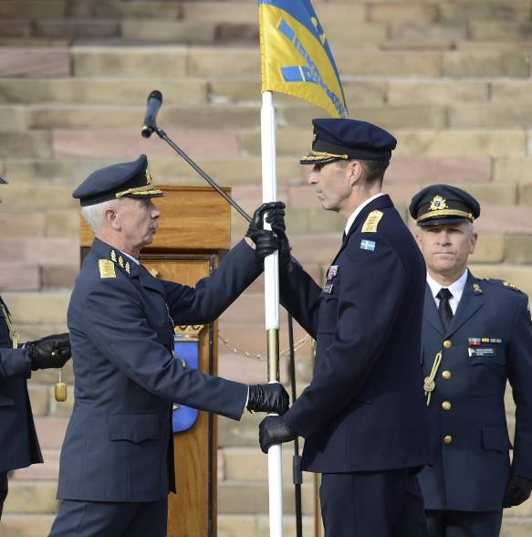

> "Jag tar befälet"

I dag tog Micael Bydén över som överbefälhavare när Sverker Göranson avslutade sin tjänstgöring som Försvarsmaktens högste chef.

Tack Sverker Göranson för dina sex och ett halvt år som ÖB!

Foto: Alexander Gustavsson/Försvarsmakten.
